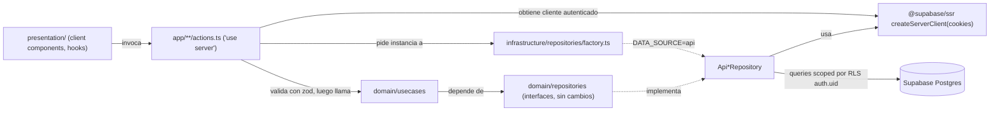
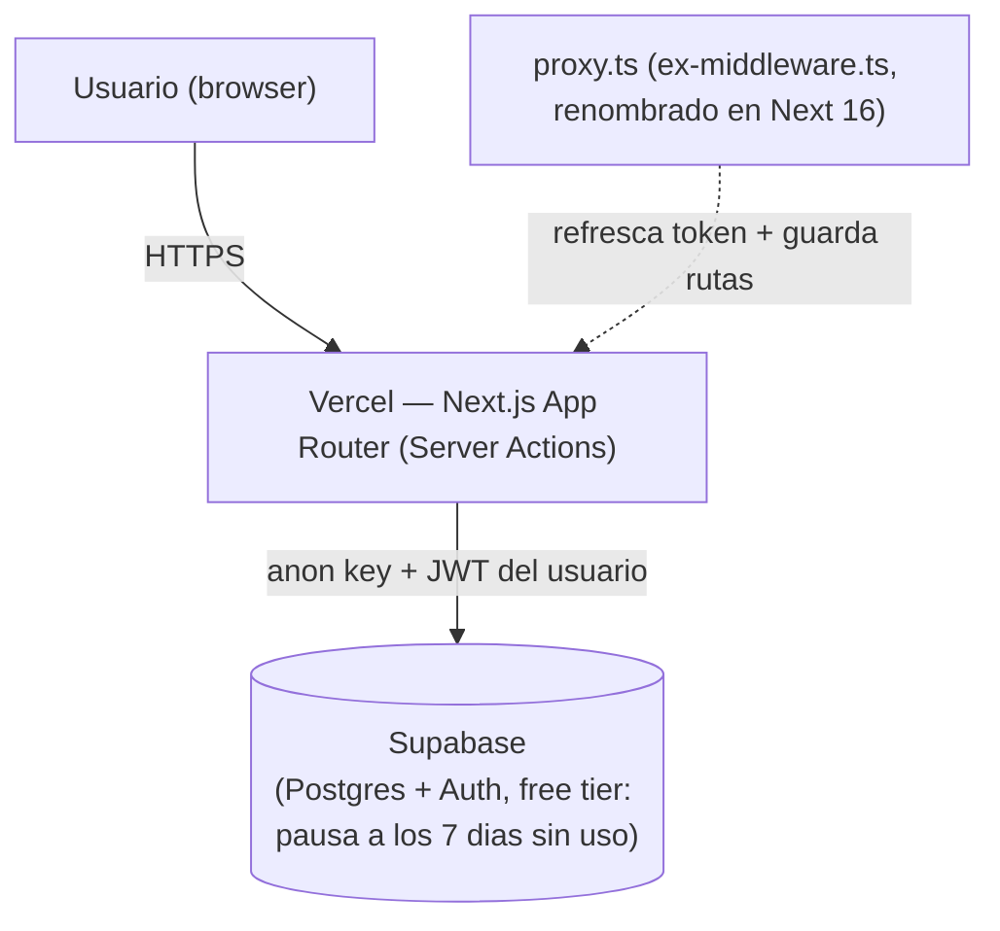

# Architecture Spine — Backend Real, Auth y Deployment — expense-manager-1.0

## Design Paradigm

Se mantiene Clean Architecture en capas del spine padre (`domain/` → `infrastructure/` → `presentation/`, frontera server-only). Este epic activa la mitad de AD-3 del padre que quedaba como placeholder: `DATA_SOURCE=api` deja de ser teórico. Se agrega **Supabase** (Postgres + Auth) como backend real detrás de esa misma factory, y **Row Level Security (RLS)** como mecanismo de scoping multi-usuario — la autorización vive en la base de datos, no en el código de la aplicación.



## Inherited Invariants

| Inherited | From parent | Binds here |
| --- | --- | --- |
| AD-1 | architecture-proyectos-2026-08-16 | Frontera unidireccional se extiende a Api*Repository — solo alcanzable desde `app/**/actions.ts` |
| AD-2 | architecture-proyectos-2026-08-16 | Api*Repository también requiere `import 'server-only'`; el service role key nunca se expone a cliente (ver AD-15 local) |
| AD-3 | architecture-proyectos-2026-08-16 | Este epic implementa la rama `DATA_SOURCE='api'` que el padre dejó como placeholder fail-loud |
| AD-4 | architecture-proyectos-2026-08-16 | Zod sigue validando en el borde antes de llegar a Api*Repository |
| AD-5 | architecture-proyectos-2026-08-16 | Estado derivado sigue en usecases; Api*Repository solo persiste/lee, no calcula |
| AD-6 | architecture-proyectos-2026-08-16 | Cliente de Supabase se instancia en `src/lib/supabase/` (no una carpeta `shared/` paralela) |
| AD-7 | architecture-proyectos-2026-08-16 | `crypto.randomUUID()` se reemplaza por `id` generado por Postgres (`gen_random_uuid()` default) — ver AD-18 |
| AD-8 | architecture-proyectos-2026-08-16 | Sin cambios — sigue vigente para componentes |
| AD-9 | architecture-proyectos-2026-08-16 | Vercel elegido como host cumple exactamente esta restricción (runtime Node.js, sin static export) |

## Invariants & Rules

### AD-10 — Hosting: Vercel (Hobby, free) [ADOPTED]

- **Binds:** deployment, .github/workflows/
- **Prevents:** reintroducir un host incompatible con Server Actions (ver AD-9 heredado); costos sorpresa en un proyecto personal; sobreestimar el margen real disponible
- **Rule:** el deployment de producción es Vercel, plan Hobby. La cuota relevante para esta app **no** es el "Fast Data Transfer" (100GB/mes, CDN→visitante, mayormente estáticos) sino el **Fast Origin Transfer (10GB/mes)** — el tráfico entre la CDN y las Vercel Functions, que es por donde pasa cada respuesta de un Server Action. 10GB/mes sigue siendo holgado para payloads JSON de una app de gastos personal, pero es la cifra a vigilar, no los 100GB. Uso personal no comercial permitido bajo sus términos. Descartados: Railway (free tier reducido a 1 USD de crédito/mes, no operable), Render (free web services duermen tras 15 min de inactividad; su Postgres free expira a los 30 días), Cloudflare Workers (requiere adaptador OpenNext no first-party, riesgo de compatibilidad con Next.js 16.2.2).

### AD-11 — Base de datos y Auth: Supabase (Postgres + Auth) [ADOPTED]

- **Binds:** infrastructure/repositories/api-*, src/lib/supabase/
- **Prevents:** sumar un segundo proveedor solo para auth cuando Supabase ya la incluye; fragmentar credenciales/SDKs
- **Rule:** Supabase es el único proveedor de datos y autenticación. Free tier verificado: 500MB storage, 50K usuarios activos/mes en auth, 1GB storage de archivos, límite de 2 proyectos. Elegido sobre Neon (más espacio pero sin auth/storage incluido) porque el usuario quiere login y potencialmente adjuntar archivos (recibos) sin sumar otro servicio.

### AD-12 — Data access: solo `@supabase/supabase-js`, sin ORM [ADOPTED]

- **Binds:** infrastructure/repositories/api-*
- **Prevents:** que dos Api*Repository se implementen con herramientas distintas (uno con Drizzle, otro con el cliente crudo), duplicando el modelo de tipos y el manejo de errores
- **Rule:** todo Api*Repository usa exclusivamente `@supabase/supabase-js` (v2.112.3 al momento de esta decisión). Los tipos de fila se generan con `supabase gen types typescript` hacia `src/lib/supabase/database.types.ts`. Ningún ORM (Drizzle, Prisma, Kysely) se agrega a este proyecto.

### AD-13 — Scoping multi-usuario vía Row Level Security, nunca `userId` explícito

- **Binds:** domain/repositories (interfaces), infrastructure/repositories/api-*, tablas Postgres, supabase/migrations/
- **Prevents:** un Api*Repository que se implemente sin filtrar por usuario y filtre datos de otra cuenta — el bug de seguridad más caro posible en este proyecto. RLS en Postgres es **opt-in**: una tabla sin `ENABLE ROW LEVEL SECURITY` expone todas las filas al anon key aunque el código nunca toque `userId` — prohibir el parámetro no alcanza por sí solo
- **Rule:** ninguna interfaz `IXRepository` ni método de `Api*Repository` recibe `userId` como parámetro. El scoping por usuario es responsabilidad exclusiva de RLS en Postgres, y **una tabla nueva no está completa sin los tres pasos siguientes en la misma migración que la crea**: (1) `ALTER TABLE <tabla> ENABLE ROW LEVEL SECURITY;`, (2) una policy `TO authenticated` por cada operación que la tabla soporte (SELECT/INSERT/UPDATE/DELETE — no una sola policy genérica), (3) condición `(select auth.uid()) = user_id` (con subselect, no `auth.uid() = user_id` suelto — evita la re-evaluación por fila que documenta Supabase). Una migración que agrega una tabla sin estos tres pasos se considera incompleta, no lista para review. El cliente de Supabase que recibe cada `Api*Repository` ya está autenticado con la sesión del usuario (AD-14); toda query queda automáticamente scoped por la base de datos.

### AD-14 — Autenticación server-side vía `@supabase/ssr` + `proxy.ts`

- **Binds:** proxy.ts (nuevo, raíz del proyecto), infrastructure/repositories/factory.ts, app/**/actions.ts
- **Prevents:** sesiones que expiran silenciosamente; cada server action reimplementando su propio manejo de cookies/tokens; dos rutas protegidas divergiendo entre "fail closed" y "fail open" según quién las haya escrito
- **Rule:** se agrega `proxy.ts` en la raíz (**no** `middleware.ts` — Next.js 16.2.2, la versión instalada en este proyecto, deprecó y renombró esa convención; confirmado en `node_modules/next/dist/docs/01-app/03-api-reference/03-file-conventions/proxy.md`) que exporta una función `proxy` (no `middleware`) desde `next/server`, usando `@supabase/ssr` (v0.12.4) para refrescar el token de auth en cada request — Server Components no pueden escribir cookies, por eso este archivo es obligatorio. `proxy.ts` es también el único lugar que decide si una ruta requiere sesión y redirige a `/login` si no la hay; ningún Server Action individual reimplementa ese chequeo (evita que una ruta quede "fail open" por omisión). `factory.ts` construye el cliente autenticado con `createServerClient` + cookies de `next/headers` y lo inyecta en cada `Api*Repository` — ningún `actions.ts` crea su propio cliente de Supabase directamente.

### AD-15 — `SUPABASE_SERVICE_ROLE_KEY` nunca se usa en la aplicación

- **Binds:** infrastructure/repositories/factory.ts, variables de entorno en Vercel, .github/workflows/ci.yml
- **Prevents:** que un bug o una copia de ejemplo de internet introduzca el service role key, saltándose silenciosamente todas las RLS policies (AD-13). Esta regla depende solo de disciplina si nada más la respalda, así que se le agrega un chequeo mecánico
- **Rule:** la app solo usa `SUPABASE_URL` y `SUPABASE_ANON_KEY` (públicas, seguras para exponer). El `service_role` key no se define como variable de entorno en Vercel para este proyecto; si en el futuro hace falta (ej. un script administrativo puntual), se ejecuta localmente, nunca en runtime de la app. El job `lint-and-build` de CI (`.github/workflows/ci.yml`) agrega un grep que falla el build si aparece el literal `SERVICE_ROLE` en `src/` — no depende solo de que alguien se acuerde de la regla.

### AD-16 — Un solo proyecto Supabase compartido (dev = prod = preview) [ADOPTED]

- **Binds:** infra/provider strategy, Vercel Preview Deployments
- **Prevents:** gastar los 2 proyectos gratis del free tier en separar ambientes que no hacen falta para un proyecto personal de un usuario; asumir en silencio que los Preview Deployments de Vercel (automáticos por PR, comportamiento default) apuntan a otro lado
- **Rule:** existe un único proyecto Supabase, usado en desarrollo local, producción (Vercel) **y** en cada Preview Deployment de PR — los previews leen/escriben la misma base real. Aceptado explícitamente como riesgo razonable para un proyecto personal de un solo usuario; revisitar si se suma otro desarrollador o si los previews empiezan a generar datos de prueba no deseados en la vista de producción.
- **Riesgo conocido, aceptado:** el free tier de Supabase pausa el proyecto tras **7 días sin actividad** (verificado en supabase.com/docs/guides/platform/free-project-pausing), restaurable hasta 90 días después. Para un proyecto de uso personal esporádico esto puede pasar; el primer acceso tras una pausa requiere despausar manualmente desde el dashboard de Supabase antes de que la app vuelva a responder. No se mitiga con infraestructura (ej. un ping programado) porque eso agrega una pieza más de lo que "simple" pide — se acepta como interrupción ocasional conocida.

### AD-17 — Migraciones de esquema vía Supabase CLI, con RLS y tipos como parte del mismo cambio

- **Binds:** supabase/migrations/ (nuevo directorio), src/lib/supabase/database.types.ts
- **Prevents:** cambios de esquema hechos a mano en el dashboard sin quedar versionados; un `database.types.ts` que queda desincronizado del esquema real porque nadie lo regeneró
- **Rule:** todo cambio de esquema Postgres se declara con `supabase migration new <nombre>` y se aplica con `supabase db push`. Los archivos de migración se versionan en el repo bajo `supabase/migrations/`. Una migración que crea o modifica una tabla no se da por terminada hasta que, en el mismo commit: (1) cumple los 3 pasos de RLS de AD-13, y (2) se corrió `supabase gen types typescript` y el diff de `database.types.ts` quedó incluido en el commit.

### AD-18 — Columna `user_id` en Postgres, invisible en el dominio TypeScript

- **Binds:** domain/entities (Transaction, Category, Budget), esquema Postgres
- **Prevents:** que `userId` se filtre a usecases o componentes de presentación, violando AD-5/AD-1 heredados; que `Api*Repository.create()` termine seteando `user_id` a mano (reintroduciendo en infraestructura el scoping que AD-13 saca de la aplicación)
- **Rule:** las tablas `transactions`, `categories`, `budgets` en Postgres llevan columna `user_id uuid not null default (select auth.uid()) references auth.users(id)` (con índice btree, requerido por AD-13 para que las RLS policies sean performantes) e `id uuid primary key default gen_random_uuid()` (reemplaza `crypto.randomUUID()` de AD-7 heredado, generado por Postgres en vez de la capa de infraestructura). El default de `user_id` en la columna significa que ningún `Api*Repository.create()` necesita asignarlo — Postgres lo completa solo a partir de la sesión autenticada. Las entidades TypeScript en `domain/entities/` **no** exponen `userId` — permanece implícito de punta a punta.

## Consistency Conventions

| Concern | Convention |
| --- | --- |
| Naming | `Api*Repository` (paralelo a `Mock*Repository` existente); cliente de Supabase vive en `src/lib/supabase/{server,client}.ts` |
| Data & formats | IDs generados por Postgres (`gen_random_uuid()`), no por la app (reemplaza AD-7 heredado solo para la rama `api`). Fechas siguen como objetos `Date` nativos (columnas `timestamptz`) |
| State & cross-cutting (auth) | Sesión de usuario resuelta una vez por request en `proxy.ts` + `factory.ts`; ningún componente ni server action llama a Supabase Auth directamente fuera de esos dos puntos |

## Stack

| Name | Version |
| --- | --- |
| @supabase/supabase-js | 2.112.3 |
| @supabase/ssr | 0.12.4 |
| Supabase CLI | (instalar al implementar; usar la última al momento de Story 1) |
| Vercel (plataforma, no dependencia npm) | Hobby plan |

## Structural Seed



```text
src/
  infrastructure/
    repositories/
      api-transaction.repository.ts   # nuevo, implementa ITransactionRepository
      api-category.repository.ts      # nuevo, implementa ICategoryRepository
      api-budget.repository.ts        # nuevo, implementa IBudgetRepository
      factory.ts                      # existente, rama DATA_SOURCE='api' pasa a implementarse
  lib/
    supabase/
      server.ts        # createServerClient (Server Actions, Server Components)
      client.ts         # createBrowserClient (solo si algún client component necesita auth UI)
      database.types.ts # generado con `supabase gen types typescript`, regenerado por AD-17
proxy.ts                   # nuevo, raiz del proyecto -- NO middleware.ts (deprecado en Next 16.2.2)
supabase/
  migrations/              # nuevo, versionado de esquema; cada una habilita RLS + policies (AD-13)
```

## Deferred

- **Backups / disaster recovery** — el free tier de Supabase no incluye Point-in-Time Recovery ni backups descargables (confirmado en supabase.com/docs/guides/platform/backups; PITR es solo Pro+). Mitigación mínima aceptada para esta escala: exportar manualmente con `supabase db dump` antes de cambios grandes de esquema, sin automatizar. Revisitar (backups automáticos, o upgrade a Pro) si los datos dejan de ser triviales de recrear a mano.
- **Proyecto Supabase separado para staging** — se difiere mientras el proyecto sea de un solo usuario (AD-16); revisitar si se suma un segundo desarrollador o un ambiente de pruebas con datos reales.
- **Storage de archivos (ej. recibos adjuntos)** — Supabase Storage está disponible en el free tier (1GB) y fue parte de por qué se eligió Supabase (AD-11), pero ninguna story de este epic lo usa todavía; se difiere su diseño (bucket, políticas de acceso) hasta que exista una capability real que lo necesite.
- **Rotación/gestión avanzada de secrets** — Vercel Environment Variables alcanza para el volumen actual; un vault dedicado no se justifica a esta escala.
- **UI de login/registro** (formularios, recuperación de contraseña, providers OAuth) — este spine fija que Supabase Auth se usa y cómo se conecta el server-side; el diseño de las pantallas de auth es un detalle de `presentation/` que no divergiría entre implementaciones y no necesita fijarse aquí.
- **Mapeo de errores de `supabase-js` (`{data, error}`) a la convención heredada de excepciones** — cada `Api*Repository` debe traducir el resultado `{data, error}` de supabase-js a la convención heredada (lanzar excepción curada, capturada por el server action → `ActionResult`); no se fija un AD nuevo porque es una aplicación directa de la convención ya heredada del spine padre, no una decisión nueva.
- **Paridad de costos Vercel vs Netlify a escala de 100-1000 usuarios** — investigado en la conversación de coaching; ambos convergen en ~$20/mes de entrada sin un ganador claro por costo. No se fija un AD porque no es una decisión bloqueante hoy (free tier alcanza); revisitar con datos de uso real si el proyecto crece.
