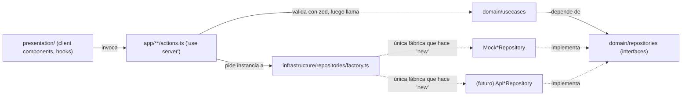

# Architecture Spine — Remediación Dominio/Infraestructura — expense-manager-1.0

## Design Paradigm

Clean Architecture en capas, ya adoptada parcialmente por el proyecto: `domain/` (entidades, interfaces de repositorio, casos de uso — sin dependencias de framework) → `infrastructure/` (implementaciones de repositorio) → `presentation/` (componentes y hooks). Esta remediación **cierra la única grieta real**: hoy la dirección de dependencia solo se respeta en lectura; en escritura, `presentation` salta directo a `infrastructure`.

El cierre se hace con una frontera adicional específica de Next.js App Router: **los repositorios (mock o reales) solo se instancian en código server-only** (`app/**/actions.ts`, Server Actions). Ningún componente `'use client'` importa `@/infrastructure/*`. Esto convierte el swap mock↔backend real en un cambio de una sola pieza (el factory), no en un refactor de cada componente.



> `actions.ts` nunca hace `new Mock*Repository()`/`new Api*Repository()` directamente — solo llama a `factory.ts`, que es el único módulo con permiso de instanciar (ver AD-2 y AD-3).

## Invariants & Rules

### AD-1 — Frontera de dependencia unidireccional, lecturas y escrituras [ADOPTED, endurecido]

- **Binds:** domain, infrastructure, presentation, app/**/actions.ts
- **Prevents:** presentación importando infraestructura para escribir datos (hoy: `transaction-form.tsx`, `app/transactions/page.tsx` importan `transactionRepository` directo)
- **Rule:** toda operación, lectura o escritura, fluye `presentation → server action → usecase → interfaz de repositorio → implementación de infraestructura`. Ningún archivo bajo `src/presentation/` ni ningún componente `'use client'` importa desde `@/infrastructure/*`.
- **Bloqueante actual (verificado con `npx tsc --noEmit`):** los 4 usecases de transacciones (`create-transaction.ts`, `get-balance.ts`, `get-monthly-stats.ts`, `get-transactions.ts`) importan un tipo `TransactionRepository` que no existe — el nombre real exportado es `ITransactionRepository` (`domain/repositories/transaction.repository.ts:3`). Esto ya viola la convención de nombres de este spine (prefijo `I`) y es el primer fix a aplicar, antes de cualquier otro trabajo de esta remediación: el proyecto no compila hasta que se corrija.

### AD-2 — Repositorios solo son alcanzables desde código server-only

- **Binds:** infrastructure/repositories, app/**/actions.ts
- **Prevents:** repositorios importados o invocados desde código cliente; cada `actions.ts` reimplementando su propio switch mock/real (defeats AD-3)
- **Rule:** ningún archivo `'use client'` ni ningún hook de presentación importa `@/infrastructure/*`. Dentro de `app/**/actions.ts` (`'use server'`), la ÚNICA forma permitida de obtener un repositorio es llamando a `infrastructure/repositories/factory.ts` (AD-3) — ningún `actions.ts` hace `new Mock*Repository()` / `new Api*Repository()` directamente. Reforzar con el paquete `server-only` (`import 'server-only'` en cada archivo de infraestructura) para que una importación indebida desde cliente rompa el build, no solo el code review.

### AD-3 — Punto único de resolución (factory)

- **Binds:** infrastructure/repositories
- **Prevents:** instanciación de repositorios dispersa que impide cambiar mock↔real sin tocar cada consumidor; cambio de firma disruptivo cuando el backend real necesite resolución async
- **Rule:** `infrastructure/repositories/factory.ts` es el ÚNICO módulo que hace `new` sobre una implementación de repositorio. Expone `getTransactionRepository(): Promise<ITransactionRepository>` / `getCategoryRepository(): Promise<ICategoryRepository>` — **firma async desde el día uno**, aunque hoy resuelvan de forma síncrona internamente, para que agregar lookup de sesión/auth en el backend real no rompa cada call site. Selecciona la implementación según `DATA_SOURCE` (`mock` | `api`, default `mock`); un valor no reconocido lanza un error al arrancar (fail-loud), nunca cae silenciosamente al mock. El mock se memoiza como singleton por proceso (para preservar su estado en memoria entre llamadas a server actions); la implementación real no asume estado compartido entre llamadas.

### AD-4 — Validación en el borde

- **Binds:** app/**/actions.ts
- **Prevents:** datos sin validar llegando al dominio (hoy: `parseFloat` sin guardas de NaN/negativo en `transaction-form.tsx:44`)
- **Rule:** cada server action valida su input con un schema `zod` colocado en el mismo archivo antes de invocar el usecase correspondiente.

### AD-5 — El estado derivado vive en casos de uso

- **Binds:** domain/usecases, presentation/components
- **Prevents:** lógica de negocio duplicada o falsificada en componentes (budget inline en `categories/page.tsx:11-26,52-54`; porcentajes "vs mes anterior" hardcodeados en `dashboard-stats.tsx:63,70,77,84`)
- **Rule:** todo cálculo derivado de transacciones/presupuestos (balance, `isNearLimit`, `isOverBudget`, variación mensual) se implementa en un usecase (existente o el nuevo `GetBudgetStatusUseCase`) y se consume ya resuelto; ningún componente recalcula estas métricas.
- **Dueño de "presupuesto" (decisión explícita, no diferida):** `GetBudgetStatusUseCase` activa la entidad `Budget` ya existente (`domain/entities/budget.ts`) a través de una nueva interfaz `IBudgetRepository` + `MockBudgetRepository`, y reemplaza el campo ad hoc `category.budget` (number) que hoy usa `categories/page.tsx`. `Budget` es el modelo correcto (tiene `month`, `year`, `spent`, `remaining`, `percentageUsed`); `category.budget` fue el síntoma detectado en la auditoría, no la base a formalizar.

### AD-6 — Home único de utilidades compartidas

- **Binds:** src/lib
- **Prevents:** dos árboles de utilidades compitiendo (`shared/` del plan original vs `lib/` de shadcn) y funciones duplicadas (`formatCurrency` ya triplicado en `dashboard-stats.tsx`, `monthly-chart.tsx`, `category-chart.tsx`)
- **Rule:** toda utilidad transversal (formato de moneda, fechas) vive exclusivamente en `src/lib/`; no se crea una carpeta `shared/` paralela.

### AD-7 — Generación de IDs

- **Binds:** infrastructure/repositories (toda implementación, presente y futura)
- **Prevents:** colisión de IDs bajo escrituras concurrentes (hoy: `` `tx-${Date.now()}` `` en `mock-transaction.repository.ts:33` y análogo en `mock-category.repository.ts:23`)
- **Rule:** todo ID de entidad se genera con `crypto.randomUUID()`; ninguna implementación de repositorio usa `Date.now()` como id. La asignación del id ocurre **dentro de `create()` de la implementación del repositorio**, nunca en el usecase ni en la capa de presentación — por eso `create()` recibe `Omit<Entity, 'id' | 'createdAt' | 'updatedAt'>` en la interfaz (patrón ya vigente en `ITransactionRepository`, se extiende a `ICategoryRepository` e `IBudgetRepository`).

### AD-8 — Fuente única de tokens de diseño

- **Binds:** app/globals.css, presentation/components/**
- **Prevents:** dos sistemas de diseño desconectados coexistiendo (`presentation/styles/theme.css`, huérfano y sin imports, vs `app/globals.css`, realmente usado)
- **Rule:** `app/globals.css` es la única fuente de tokens; se elimina `presentation/styles/theme.css`; los componentes consumen clases/tokens semánticos, no utilidades de paleta cruda hardcodeadas por componente — esto incluye tanto clases nombradas (`bg-emerald-500`) como valores arbitrarios (`bg-[#10b981]`); ambas formas están prohibidas por igual.

## Consistency Conventions

| Concern | Convention |
| --- | --- |
| Naming (entidades, archivos, interfaces) | Interfaces de repositorio prefijadas `I` (`ITransactionRepository`); casos de uso con sufijo `UseCase`; server actions en `app/**/actions.ts` con verbos en imperativo (`createTransaction`, `getBudgetStatus`) |
| Data & formats (ids, fechas, moneda) | IDs: `crypto.randomUUID()` (AD-7). Fechas: objetos `Date` nativos de extremo a extremo — Next 16 + React 19 los serializan sin conversión manual a través de Server Actions. Moneda: `Intl.NumberFormat('es-PE', ...)` centralizado en `src/lib/format.ts` (AD-6) |
| State & cross-cutting (mutación, errores, config) | Server actions devuelven `ActionResult<T>` (`src/lib/types.ts`) = `{ success: true, data: T } \| { success: false, error: string }` para errores de negocio/validación esperados (input inválido, entidad no encontrada); `throw` se reserva para lo que Next.js modela así por convención (`redirect()`, `notFound()`, fallos de autorización). Errores de zod se unen en un solo string legible (`issues.map(i => i.message).join('; ')`); excepciones de repositorio se capturan y se mapean a un mensaje curado — nunca se filtra `e.message` crudo al cliente. `DATA_SOURCE` env var controla mock↔real (AD-3); validación zod en el borde (AD-4) |

## Stack

| Name | Version |
| --- | --- |
| next | 16.2.2 |
| react / react-dom | 19.2.4 |
| typescript | ^5 |
| tailwindcss | ^4 |
| recharts | ^3.8.1 |
| framer-motion | ^12.38.0 |
| date-fns | ^4.1.0 |
| zod (nuevo, requerido por AD-4) | ^4.4.3 (verificado en zod.dev, ago-2026) |

## Structural Seed

```text
src/
  app/                          # Next.js App Router (raíz obligatoria del framework)
    transactions/
      page.tsx                  # client component, solo llama server actions
      actions.ts                # 'use server' -- único punto de instanciación de repos + validación zod (AD-2, AD-3, AD-4)
    categories/
      page.tsx
      actions.ts
  domain/                       # sin imports de framework (invariante ya vigente, preservar)
    entities/                   # Transaction, Category, Budget, Account
    repositories/                # ITransactionRepository, ICategoryRepository, IBudgetRepository (nuevo, AD-5)
    usecases/
      transactions/             # Create/Get/Update/Delete/GetBalance/GetMonthlyStats
      budgets/                  # GetBudgetStatusUseCase (nuevo, AD-5)
  infrastructure/
    repositories/
      factory.ts                # AD-2/AD-3: única fábrica que instancia repos, switch mock/real vía DATA_SOURCE
      mock-transaction.repository.ts
      mock-category.repository.ts
      mock-budget.repository.ts # nuevo, AD-5
    data/                       # datasets estáticos, consumidos solo por los Mock*Repository
  lib/                          # AD-6: único home de utilidades compartidas
    format.ts                   # formatCurrency etc. (consolida las 3 copias existentes)
    types.ts                    # ActionResult<T> y otros tipos de borde compartidos
  presentation/
    components/
    hooks/                      # ya no importan @/infrastructure directamente (AD-2)
```

## Deferred

- **Diseño de backend real** (rutas API vs BaaS, esquema de base de datos, autenticación, deployment/infra/operaciones): fuera de alcance de este spine — se aborda en un spine de arquitectura de backend separado que se apoya en el punto de swap definido por AD-3. Esta remediación deliberadamente no decide el envelope operacional; ese dimensión pertenece al siguiente run.
- **Entidad `Account`**: existe en el dominio pero sin repositorio ni usecase. No bloquea el swap de Transaction/Category/Budget; se retoma cuando el backend defina soporte multi-cuenta.
- **Estrategia de testing** (unit/integration/e2e): el proyecto tiene cero tests hoy. Fuera de alcance de este spine; se recomienda un run de `bmad-testarch-test-design` antes o junto al backend.
- **Fix puntual de tipos Recharts v3** (`Tooltip formatter` en `category-chart.tsx:87`, `monthly-chart.tsx:87`): defecto de tipos, no decisión arquitectónica — tarea de implementación directa.
- **Cabos sueltos funcionales** (ruta `/reports` inexistente enlazada en la navegación, botón "Nueva Categoría" sin handler): defectos a corregir en la implementación, no requieren AD.
